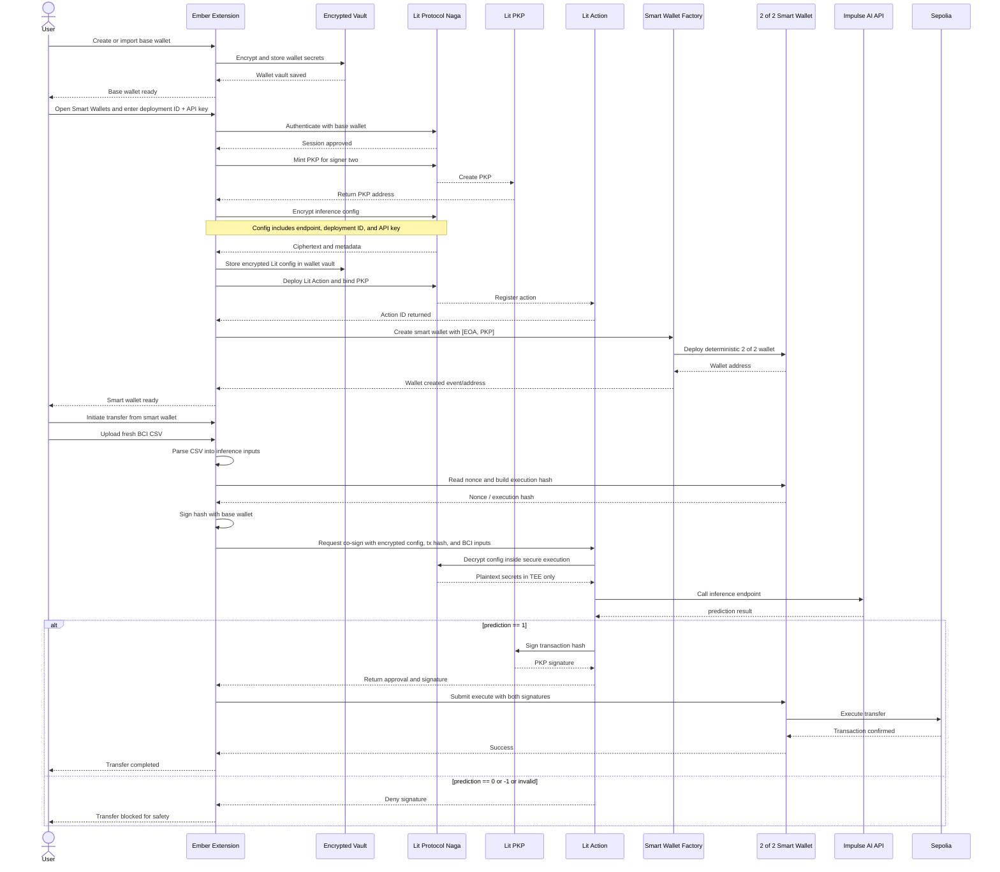

# Ember Wallet

Ember is an anti-coercion smart contract wallet built for the intersection of neurotech, digital rights, and programmable cryptography. It is designed around one core idea: traditional wallets protect against remote digital attackers, but they do almost nothing when the threat is physical coercion. Ember adds a biometric panic check directly into the transaction flow, turning live cognitive state into a security condition before assets can move.

The current prototype is a browser extension wallet for Ethereum Sepolia. A user first creates or imports a normal wallet in the extension, then creates a Lit-backed smart wallet where their extension wallet is signer one and a Lit PKP is signer two. When the user wants to send funds from the smart wallet, Ember requires both signatures. The user signs locally, then uploads fresh BCI-derived readings in CSV form. A Lit Action securely decrypts the user’s Impulse AI inference configuration, sends the feature payload to the Impulse inference API, and only returns the second signature if the model approves the transaction. If the model detects stress, fear, panic, stale data, or an invalid result, the Lit signer refuses to sign and the transaction cannot execute.

## What Problem Ember Solves

Current wallets are highly effective at protecting keys from online theft, malware, and unauthorized remote access. They are far less effective against the five-dollar wrench attack, where an attacker physically pressures a user into unlocking a wallet and approving a transfer. In that scenario, the wallet cannot tell the difference between voluntary consent and forced approval.

Ember introduces a real-time neuro-biometric approval layer. Instead of trusting only possession of a private key, Ember requires evidence that the person approving the transaction is in a calm, non-coerced state. The result is a wallet model built around cognitive sovereignty and physical fail-safes, not just key custody.

## How It Works

Ember uses a 2-of-2 multisig smart wallet:

- Signer one is the user’s normal extension wallet.
- Signer two is a Lit PKP managed through Lit Protocol 

The user creates a multisig smart wallet:

1. The extension authenticates to Lit with the user’s wallet.
2. Ember mints a PKP that will act as the second signer.
3. Ember generates a dedicated Lit Action for that wallet.
4. The user provides an Impulse AI `deployment_id` and `apiKey`.
5. Ember encrypts `{ endpoint, deploymentId, apiKey }` with Lit access control conditions and stores only ciphertext plus metadata in the wallet vault.
6. The PKP address becomes signer two in the smart wallet deployed on Sepolia.

When the user sends a transaction from the smart wallet:

1. The user prepares a send and uploads a CSV containing fresh BCI-derived features.
2. Ember parses the CSV into the inference input object expected by the Impulse AI endpoint.
3. Ember computes the smart-wallet execution hash and signs it locally with signer one.
4. Ember sends the execution hash, encrypted inference config, and parsed feature payload to the Lit Action.
5. Inside Lit’s execution environment, the Lit Action decrypts the Impulse credentials, calls the Impulse API, and checks the model output.
6. If `prediction === 1`, the Lit PKP signs the same execution hash and returns the second signature.
7. Ember submits the fully signed transaction to the smart wallet contract.
8. If the result is `0`, `-1`, invalid, stale, or the API call fails, the Lit Action refuses to sign and the transaction is blocked.

This means a coerced attacker can force a user to open the wallet, but they still cannot move assets unless the biometric and AI-based panic check passes.


### NeuroTrack Integration

Ember sits directly at the boundary of BCI, cognition, and computation. It treats neural or neuro-adjacent biometric readings as a security primitive, not just an analytics signal. The project is grounded in cognitive sovereignty: the user’s live mental state becomes part of the consent model for moving value. 


### Lit Protocol Integration

Source: [`src/lib/lit`](https://github.com/emberbci/wallet/tree/main/src/lib/lit)

- PKPs for decentralized second-signer key management
- Lit Actions for programmable signing policy
- Lit encryption for protecting inference configuration


### Impulse AI Integration

Ember uses Impulse AI as a cognitive oracle in the transaction approval flow. The prototype is built around the Impulse-hosted inference endpoint pattern, where the model is deployed once and later called with feature inputs derived from CSV-based BCI readings. Impulse is what transforms raw biometric input into a transaction gating decision that the Lit Action can enforce cryptographically.

## Sequence Diagram



## Technical Architecture

### Extension Layer

The browser extension is the user-facing wallet. It handles:

- wallet creation and import
- encrypted local vault storage
- ETH and ERC-20 portfolio tracking
- smart-wallet creation and discovery
- CSV upload and parsing
- sending normal EOA transactions
- building smart-wallet execution payloads

The extension stores the base wallet in `chrome.storage.local` using AES-GCM encryption derived from the user’s password. It also stores Lit-backed wallet metadata and Lit-encrypted inference ciphertext. Plaintext Impulse credentials are not intended to be stored in extension storage after setup.

### Smart Wallet Layer

The smart wallet is a deterministic 2-of-2 wallet contract deployed via a factory on Sepolia. It has:

- exactly two owners
- a nonce-based `execute` path
- strict ordered-signature validation
- replay protection

The wallet executes arbitrary ETH or ERC-20 transfers only when both the user and the Lit PKP have signed the same execution hash.

### Lit Layer

Lit Protocol is used for:   

- PKP generation for signer two
- Lit Action execution as the transaction policy engine
- encrypted inference secret storage
- programmable second-signature issuance

Each Lit-backed smart wallet gets its own Lit Action. That action is responsible for decrypting the Impulse configuration, invoking the inference API, evaluating the result, and producing the PKP signature only when the biometric approval condition is satisfied.

### Impulse AI Layer

Impulse AI is used as the inference engine that evaluates the uploaded biometric feature set. Ember currently expects a deployment that accepts feature inputs similar to:

- `mean_2_a`
- `mean_3_a`
- `fft_465_a`
- `fft_511_a`
- `fft_556_a`


The Impulse response is expected to include a `prediction` field, and the current prototype allows execution only when `prediction === 1`.


## Local Setup

1. Install dependencies:

```bash
npm install --legacy-peer-deps
```

2. Build the extension:

```bash
npm run build
```

3. Load the extension:

- Open Chrome or Chromium
- Go to `chrome://extensions`
- Enable Developer Mode
- Load either the repo root or the `dist` directory as an unpacked extension

